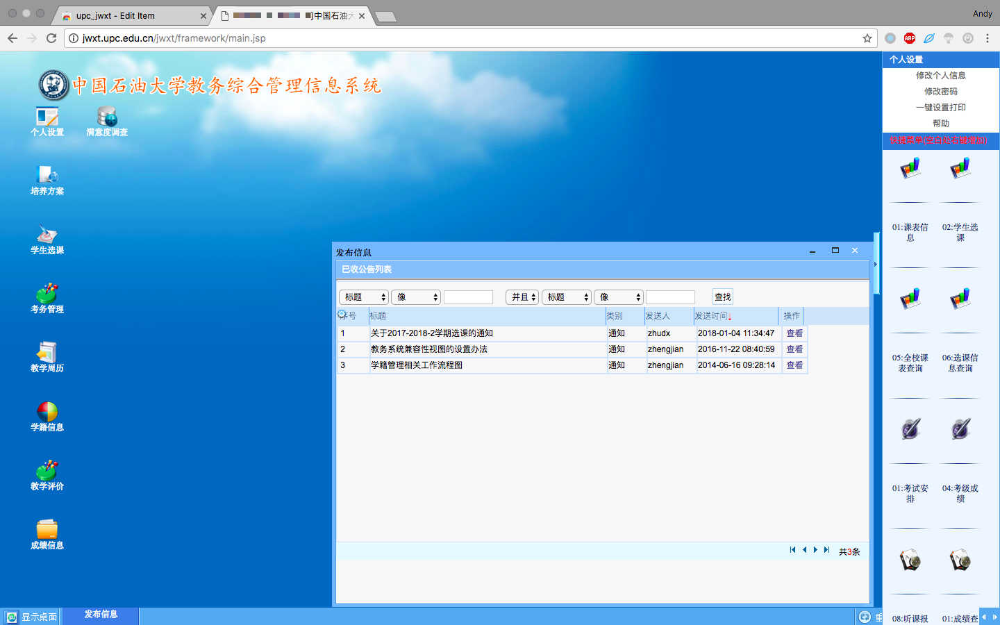
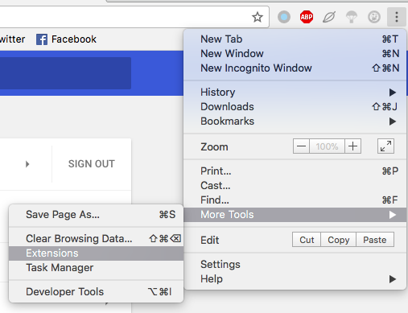

## 中国石油大学(华东) 教务系统 辅助工具

解决Chrome访问教务处出现无法创建对象、权限认证失败等问题。

#### macOS+Chrome 63 截图：

#### 食用方法：

1、找到Chrome设置，打开 Extensions 页面。

2、开启开发者模式(Developer mode)，并选择载入未打包的插件(Loading unpacked extension...)，将整个工程.zip文件下载并选择解压后的目录即可。

#### 致谢：

感谢东北师范大学 [Efly Studio](https://github.com/EflyStudio/nenu-jwc-repair "小组") 提供的修改版js。